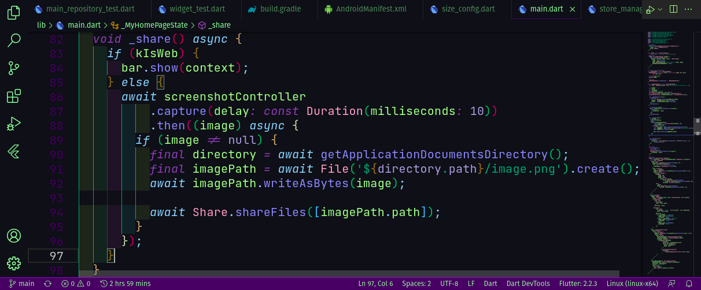
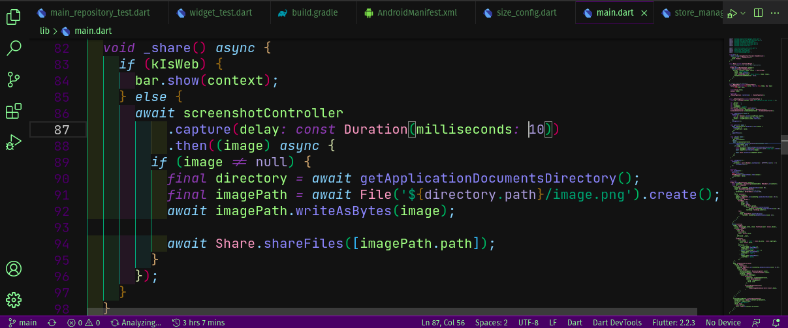

<h1 align="center">
  <br>
  
  <br><br>
  UFO Theme for Visual Studio Code
  <br><br>
</h1>

<h3 align="center">Install the UFO Theme in your VS Code editor.</h3>

<p align="center">
    <a href="https://marketplace.visualstudio.com/items?itemName=wendreof.ufo"></a>&nbsp;
    <a href="https://marketplace.visualstudio.com/items?itemName=wendreof.ufo"></a>&nbsp;
    <a href="https://marketplace.visualstudio.com/items?itemName=wendreof.ufo"></a>&nbsp;
    <a href="https://marketplace.visualstudio.com/items?itemName=wendreof.ufo"></a>
</p>

### The Truth is Out There

#### Dark Blue


#### Dark


## Installation Instructions

## Installation
1. Open the extensions sidebar on Visual Studio Code
2. Search for Ufo Theme
3. Click Install
4. Click Reload to reload your editor
5. Select the Manage Cog (bottom left) > Color Theme ＞ Theme
6. 🌟🌟🌟🌟🌟 Rate it five-stars 😃

## Contributions

At the moment, there are no active contributions, but feel free to get in touch with any suggestions or ideas!

## Support & Donations

If you enjoy this extension, please consider [starring the repository](https://github.com/wendreof/ufo-theme/stargazers) on GitHub! I welcome any feedback or new ideas for improvements. 

You can also support the development by donating:  
[](https://www.buymeacoffee.com/wendreof)

## Developed and Maintained By

<a href="https://github.com/wendreof/">
  
  <br>
  Wendreo Fernandes
</a>

## Recommended Extensions

For the best experience with UFO Theme, check out these related extensions:

* [Bracket Pair Colorizer 2](https://marketplace.visualstudio.com/items?itemName=CoenraadS.bracket-pair-colorizer-2)
* [Indent Rainbow](https://marketplace.visualstudio.com/items?itemName=oderwat.indent-rainbow)
* [JetBrains Mono Font](https://www.jetbrains.com/lp/mono/)

To make your code appear italic, add the following to your `settings.json` file:

```json
"editor.tokenColorCustomizations": {
  "textMateRules": [
    {
      "name": "Italic Font Style",
      "scope": [
        "comment", "keyword", "storage", "keyword.control", "keyword.control.from", 
        "keyword.control.flow", "keyword.operator.new", "keyword.control.import", 
        "keyword.control.export", "keyword.control.default", "keyword.control.trycatch",
        "keyword.control.conditional", "storage.type", "storage.type.class", 
        "storage.modifier.tsx", "storage.type.function", "storage.modifier.async", 
        "variable.language", "variable.language.this", "variable.language.super", 
        "meta.class", "meta.var.expr", "constant.language.null", 
        "support.type.primitive", "entity.name.method.js", "entity.other.attribute-name",
        "punctuation.definition.comment", "text.html.basic entity.other.attribute-name",
        "tag.decorator.js entity.name.tag.js", "tag.decorator.js punctuation.definition.tag.js",
        "source.js constant.other.object.key.js string.unquoted.label.js"
      ],
      "settings": {
        "fontStyle": "italic"
      }
    }
  ]
}
